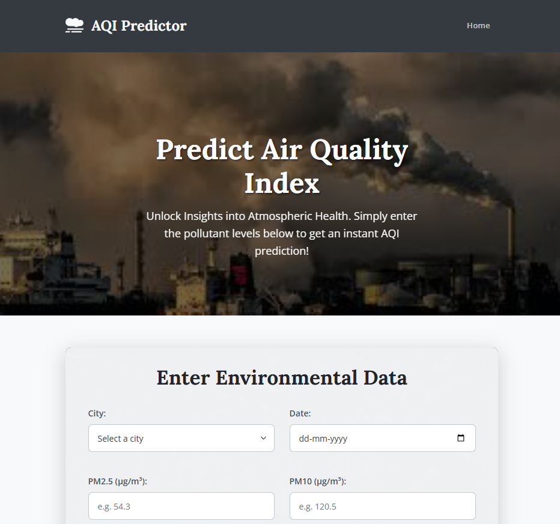

## End-to-End Air Quality Index Prediction using MLOps



This project builds an end-to-end machine learning pipeline for predicting the Air Quality Index (AQI), integrated with MLOps practices for automation, tracking, and deployment.

---

### Project Overview

The goal is to predict AQI based on atmospheric pollutant levels using an automated ML pipeline governed by MLOps practices. The solution spans data collection to live model deployment.

---

### Dataset

The dataset is sourced from the **Central Pollution Control Board (CPCB)**: [https://cpcb.nic.in/](https://cpcb.nic.in/).  
It contains pollutant data such as PM2.5, PM10, NO, NO2, CO, and O3 across various Indian cities.

---

### Implemented ML Pipeline Stages

1. Data Ingestion  
2. Data Validation  
3. Data Transformation & Feature Engineering  
4. Model Training & Hyperparameter Tuning  
5. Model Evaluation  
6. **Model Deployment** as a real-time prediction web service using Flask & Docker

---

### MLOps Stack

<p>
  
  
  
  
  
  
</p>
---

### Features

- Web interface to input pollutant values
- Real-time AQI prediction with health category (Good, Moderate, Poor, etc.)
- ML pipeline versioned and reproducible using MLOps

---

### Project Structure

```
.
├── .github/workflows/       # GitHub Actions CI/CD workflow definitions
├── artifacts/               # Local repository for pipeline output artifacts
├── config/                  # Configuration files (e.g., config.yaml)
├── logs/                    # Runtime logs for pipeline executions
├── research/                # Jupyter notebooks for exploratory data analysis and initial experimentation
├── src/MLProject/           # Core Python source code for the ML application
│   ├── components/          # Modular implementations of individual pipeline steps
│   ├── config/              # Configuration loading and management
│   ├── constants/           # Global constants
│   ├── entity/              # Data classes for defining data structures and configurations
│   ├── pipeline/            # Orchestrates the sequence of ML pipeline stages
│   └── utils/               # General utility functions
├── static/                  # Web assets (CSS, images) for the Flask application
├── templates/               # HTML templates for the Flask web UI
├── .gitignore               # Specifies files/directories to be ignored by Git
├── app.py                   # Flask web application entry point
├── Dockerfile               # Docker image build instructions
├── download_ml_artifacts.py # Python script for downloading MLflow artifacts
├── entrypoint.sh            # Entrypoint script for the Docker container
├── main.py                  # Main script to execute the full ML training pipeline
├── params.yaml              # Parameter configurations for models and pipeline steps
├── README.md                # This document
├── requirements.txt         # Python package dependencies
└── schema.yaml              # Defines the expected data schema for validation

```
